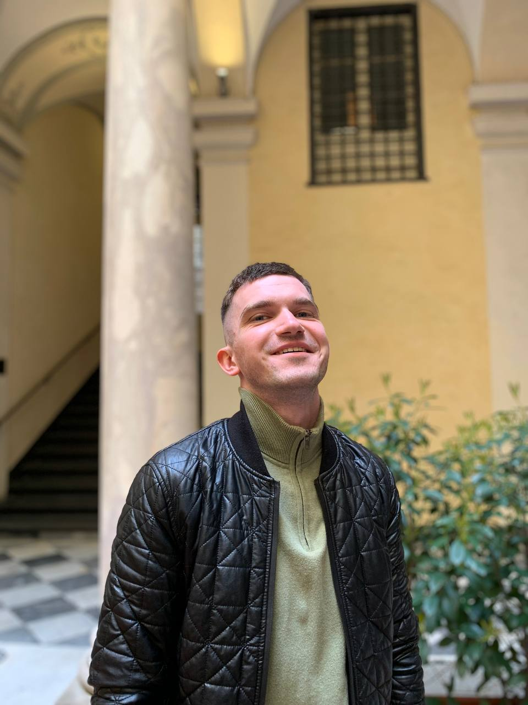

# Daniil Sinkevich
## Contacts
+ **Location**: Minsk, Belarus
+ **Phone**: +375 29 113-96-06 
+ **Email**: daniil_sinkevich99@mail.ru
+ **Discord**: Daniil(@DaniUltras)
+ **GitHub**: [DaniUltras](https://github.com/DaniUltras)

## About me
It is important for me to get the new opportunities, which the IT sphere can give me – new profession, career growth, unleashing my potential and my talents, join with like-minded people. My strenghts are analytical mind, decision-making, perseverance, ability to multi-task, strong focus on tasks, focus on results, emotional intelligence, strong empathy, teamwork and negotiation skills, responsibility. I accept problems as obstacles to be overcome. I am very focused on learning. Self-development and knowledge are my life goals and priorities, so I want to get as much as possible knowledge and skills from this course and apply them successfully in my professional life. 

## Skills
+ HTML
+ CSS
+ JavaScript(Basic)

## Code Example
```JavaScript
for (let i = 1; i <=100; i++) {
    var word = '';
    if(i % 3 === 0) {
        word = 'Fizz';
    } 
    if(i % 5 === 0) {
        word = word + 'Buzz';
    }
    if(word == '') {
        console.log(i);
    } else {
        console.log(word);
    }
};
```
## Experience
[GitHub](https://daniultras.github.io/rsschool-cv/cv)

## Education
+ **College**: Belarussian National Medical College

## English
**INTERMEDIATE**(Studying in Lingualeo.com)